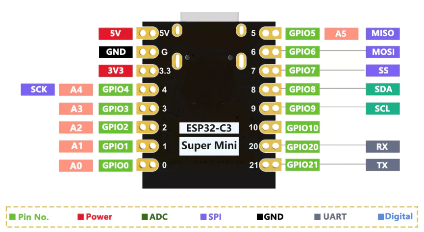

# 光悅旋鈕專案

## 硬體設備清單

- [esp32-c3-super-mini](https://shopee.tw/%E3%80%90%E9%80%A0%E7%89%A9%E4%BA%BA%E3%80%91%E3%80%8A%E5%8F%AF%E7%B5%B1%E7%B7%A8%E3%80%8BESP32-C3-SuperMini-%E9%96%8B%E7%99%BC%E6%9D%BF-Type-C-WIFI-%E8%97%8D%E7%89%99-%E8%BF%B7%E4%BD%A0%E9%96%8B%E7%99%BC%E6%9D%BF-MINI%E6%9D%BF-i.899779.43305501428?sp_atk=8e8c9748-0992-47f2-bc8b-1ffef3343652&xptdk=8e8c9748-0992-47f2-bc8b-1ffef3343652)
- [EC11 旋轉編碼器](https://shopee.tw/EC11%E6%97%8B%E8%BD%89%E7%B7%A8%E7%A2%BC%E5%99%A8%E5%B8%B6%E9%96%8B%E9%97%9C20mm%E6%A2%85%E8%8A%B1%E6%9F%84%E5%8D%8A%E8%BB%B820%E4%BD%8D%E8%84%88%E8%A1%9D%E6%95%B8%E4%BD%8D%E4%BF%A1%E8%99%9F%E9%9B%BB%E4%BD%8D%E5%99%A815mm-i.1201407581.27929225342)

## 接腳配置

| ESP32-C3 | EC11編碼器 | 功能說明 |
|----------|------------|----------|
| 3V3      | VCC        | 電源正極 |
| GND      | GND        | 電源負極 |
| GPIO2    | CLK        | 時鐘信號 |
| GPIO3    | DT         | 數據信號 |
| GPIO10   | SW         | 按鈕開關 |

### 接腳選擇說明

- **GPIO2, GPIO3**: 選擇這兩個連續的GPIO作為編碼器的CLK和DT信號，方便程式處理
- **GPIO10**: 作為按鈕輸入，支援內部上拉電阻
- **3V3**: ESP32-C3的3.3V輸出，為編碼器供電
- **GND**: 共同接地

### 注意事項

- ESP32-C3-SuperMini的可用GPIO較少，需避免使用boot和串口相關的腳位
- GPIO0, GPIO1 為UART腳位，盡量避免使用
- GPIO8, GPIO9 為SPI Flash腳位，不可使用
- 選擇的GPIO都支援輸入功能和內部上拉電阻
